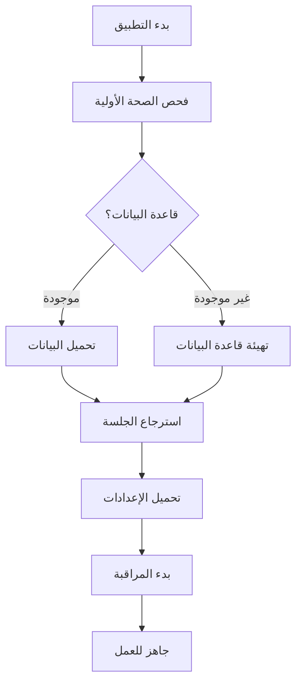

# 🏛️ UnionSphere Enterprise - سير العملية التشغيلية
## نظام التشغيل المؤسسي الاحترافي - دليل التنفيذ والعمل اليومي

---

## 📋 1. مراحل التشغيل الاحترافي

### مرحلة 1: البدء والتهيئة (Startup & Initialization)


#### خطوات التهيئة:
1. **فحص صحة النظام** - `runHealthChecks()`
2. **استرجاع الجلسة** - Session restoration
3. **تحميل الإعدادات** - Load user preferences
4. **بدء المراقبة** - Start connection monitoring

---

## 🔄 2. دورة حياة العمليات (Operations Lifecycle)

### خطوات كل عملية:
1. **إنشاء العملية** - `createOperation(type, totalSteps, metadata)`
2. **بدء التنفيذ** - `startOperation(operationId)`
3. **تحديث التقدم** - `updateProgress(currentStep, message)`
4. **إكمال/فشل** - `completeOperation()` أو `failOperation()`

### أنواع العمليات الرئيسية:
| العملية | الوصف | الفترة الافتراضية |
|---------|-------|-------------------|
| backup | النسخ الاحتياطي | 24 ساعة |
| sync | المزامنة | يدوي/تلقائي |
| import | الاستيراد | حسب الملف |
| export | التصدير | فوري |
| migration | هجرة البيانات | لمرة واحدة |
| cleanup | التنظيف | أسبوعي |

---

## 🔧 3. سير العمل اليومي

### الصباح (8:00 - 9:00)
- ✅ فحص صحة النظام
- ✅ مراجعة سجلات الأخطاء السابقة
- ✅ التحقق من النسخ الاحتياطية

### طوال اليوم (9:00 - 17:00)
- ✅ مراقبة الاتصال
- ✅ مزامنة البيانات كل 10 دقائق
- ✅ تسجيل الأنشطة

### المساء (17:00 - 18:00)
- ✅ مراجعة السجلات
- ✅ إنشاء نسخة احتياطية نهائية
- ✅ إعداد التقرير اليومي

---

## 🛡️ 4. إجراءات الأمان اليومية

### مراقبة الأمان
```typescript
// فحص حد المحاولات
const rateLimitStatus = checkRateLimit('login_email@domain.com');
if (!rateLimitStatus.allowed) {
  // قفل الحساب مؤقتاً
  throw new Error(rateLimitStatus.message);
}
```

### تسجيل المراقبة
- ✅ كل عملية دخول/خروج
- ✅ كل عملية تعديل بيانات
- ✅ كل عملية تصدير/استيراد
- ✅ محاولات الاختراق

---

## 📊 5. مؤشرات الأداء (KPIs)

### تقنية:
| المؤشر | الهدف | الجدولة |
|--------|-------|---------|
| زمن الاستجابة | < 200ms | مستمر |
| معدل الأخطاء | < 1% | يومي |
| نسبة النسخ الاحتياطية | 100% | أسبوعي |
| معدل المزامنة | > 95% | يومي |

### عملية:
| المؤشر | الوصف | التقارير |
|--------|-------|----------|
| عدد المستخدمين النشطين | > 200 | يومي |
| عدد الكيانات المُدارة | > 500 | أسبوعي |
| معدل الامتثال | > 85% | شهري |
| وقت التشغيل | > 99.5% | مستمر |

---

## 🚨 6. إجراءات الطوارئ

### في حالة فشل النظام:
1. **التسجيل** - حفظ تفاصيل الخطأ
2. **العزل** - منع انتشار الخطأ
3. **الاستعادة** - استعادة من أحدث نسخة احتياطية
4. **الإبلاغ** - إرسال تنبيه للمسؤولين
5. **التحليل** - تحليل السبب وتحديد الحل

### أوامر الطوارئ:
```bash
# فحص صحة النظام
pnpm run health-check

# إنشاء نسخة احتياطية طارئة
pnpm run backup --emergency

# مسح السجلات القديمة
pnpm run cleanup --days=30
```

---

## 📈 7. تقارير الجاهزية

### التقرير اليومي:
- عدد العمليات المنجزة
- عدد الأخطاء المكتشفة
- حالة النسخ الاحتياطية
- معدل المزامنة

### التقرير الأسبوعي:
- تحليل الأداء
- مراجعة الأمان
- توصيات التحسين
- خطة الصيانة

---

## 🔁 8. دورة التحسين المستمر

### كل أسبوع:
- مراجعة السجلات
- تحليل الأداء
- تحسين الإعدادات

### كل شهر:
- ترقية الأمان
- مراجعة النسخ الاحتياطية
- تحديث الوثائق

---

## 📞 9. جهات الاتصال

- **الدعم الفني**: support@unionsphere.gov.ye
- **الأمن**: security@unionsphere.gov.ye  
- **الطوارئ**: +967 1 234 567

---

**تم التحديث**: يوليو 2026
**الإصدار**: 2.0.0 Enterprise